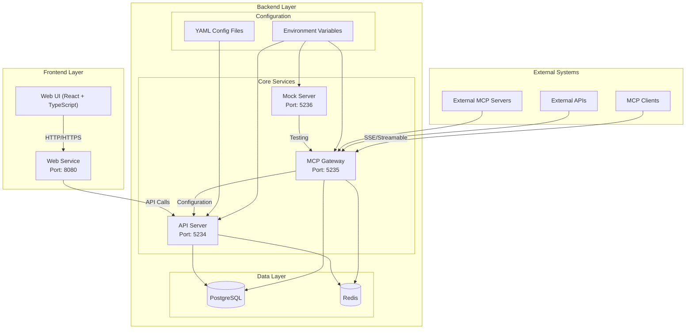

# Unla Architecture Diagram

## Component Descriptions

### Frontend Layer
- **Web UI**: React + TypeScript frontend that provides the dashboard for managing MCP services
- **Web Service**: Serves the frontend dashboard on port 8080

### Backend Layer

#### Core Services
- **API Server**: Manages configurations and authentication on port 5234
- **MCP Gateway**: Core gateway service that transforms APIs to MCP protocol on port 5235
- **Mock Server**: Provides testing capabilities on port 5236

#### Data Layer
- **PostgreSQL**: Primary database for persistent storage
- **Redis**: Used for configuration synchronization

#### Configuration
- **YAML Config Files**: File-based configuration management
- **Environment Variables**: Runtime configuration via environment variables

### External Systems
- **External MCP Servers**: Existing MCP servers that can be proxied
- **External APIs**: REST APIs that can be converted to MCP protocol
- **MCP Clients**: Clients that consume the MCP services via SSE or Streamable HTTP

## Deployment Modes

Unla supports two deployment modes:

1. **All-in-One**: Single container with all services bundled together
2. **Multi-Container**: Separate containers for each service, orchestrated with Docker Compose

## Technology Stack

- **Frontend**: React, TypeScript, Vite, Tailwind CSS
- **Backend**: Go (Gin, GORM)
- **Database**: PostgreSQL, Redis
- **Deployment**: Docker, Docker Compose, Kubernetes (Helm)