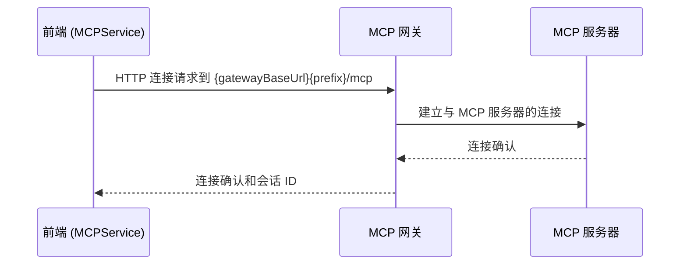
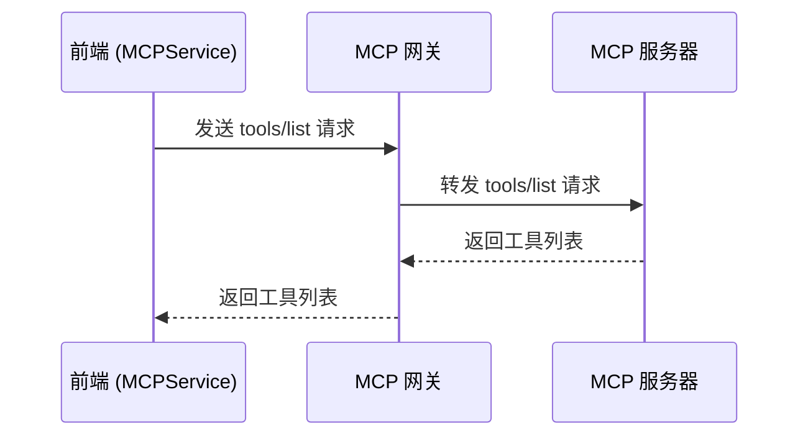
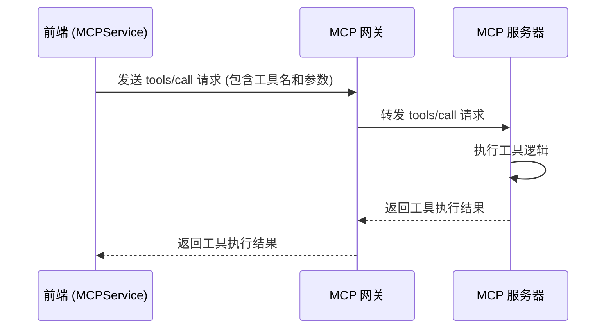

# MCP Service 分析

本文档分析了 [/web/src/services/mcp.ts](/web/src/services/mcp.ts) 文件中 [MCPService](/web/src/services/mcp.ts#L24-L250) 类的实现，特别是 [connect](/web/src/services/mcp.ts#L39-L108)、[getTools](/web/src/services/mcp.ts#L125-L142) 和 [callTool](/web/src/services/mcp.ts#L144-L183) 方法如何与后端服务通信。

## 概述

[MCPService](/web/src/services/mcp.ts#L24-L250) 是前端与 MCP 服务器通信的核心服务。它使用 [@modelcontextprotocol/sdk](/web/src/services/mcp.ts#L24-L250) 库来处理与 MCP 服务器的交互，包括建立连接、获取工具列表和调用工具等功能。

## 核心方法分析

### 1. connect 方法

[connect](/web/src/services/mcp.ts#L39-L108) 方法用于建立与 MCP 服务器的连接。

#### URL 构建过程

```typescript
const gatewayBaseUrl = window.RUNTIME_CONFIG?.VITE_MCP_GATEWAY_BASE_URL || '';
const serverUrl = new URL(`${gatewayBaseUrl}${prefix}/mcp`, window.location.origin);
```

URL 构建涉及以下部分：
1. `gatewayBaseUrl` - 从环境变量 `VITE_MCP_GATEWAY_BASE_URL` 获取，通常是 MCP 网关的基础 URL
2. `prefix` - 由调用方传入的路由前缀，对应特定的 MCP 服务
3. `/mcp` - 固定的路径后缀，表示 MCP 协议端点

例如：
- 如果 `VITE_MCP_GATEWAY_BASE_URL` 是 `/gateway`，`prefix` 是 `/api/my-service`，那么最终 URL 是 `http://localhost:端口/gateway/api/my-service/mcp`
- 如果 `VITE_MCP_GATEWAY_BASE_URL` 未设置，`prefix` 是 `/api/my-service`，那么最终 URL 是 `http://localhost:端口/api/my-service/mcp`

#### 通信机制

[connect](/web/src/services/mcp.ts#L39-L108) 方法使用 [StreamableHTTPClientTransport](/web/src/services/mcp.ts#L84-L97) 建立与 MCP 服务器的连接，该传输层支持流式 HTTP 通信，符合 MCP 协议要求。

#### 认证处理

认证信息通过 HTTP 头部传递：
- 如果使用自定义头部名称，会设置对应的头部和 `x-custom-auth-header` 头部
- 如果使用标准的 `Authorization` 头部，会将其设置为 `Bearer ${authToken}` 格式

### 2. getTools 方法

[getTools](/web/src/services/mcp.ts#L125-L142) 方法用于获取 MCP 服务器提供的工具列表。

#### 请求目标

该方法通过已建立的 MCP 连接调用 `client.listTools()` 方法，这会向 MCP 服务器发送一个 `tools/list` 请求。

#### 通信流程

1. 前端通过已建立的 [StreamableHTTPClientTransport](/web/src/services/mcp.ts#L84-L97) 连接发送 `tools/list` 请求
2. 请求被发送到之前 [connect](/web/src/services/mcp.ts#L39-L108) 方法中构建的 URL
3. MCP 网关接收请求并转发给对应的 MCP 服务器
4. MCP 服务器返回工具列表
5. 前端接收并解析响应，返回工具数组

### 3. callTool 方法

[callTool](/web/src/services/mcp.ts#L144-L183) 方法用于调用 MCP 服务器上的特定工具。

#### 请求目标

该方法通过已建立的 MCP 连接调用 `client.request()` 方法，发送一个 `tools/call` 请求。

#### 通信流程

1. 前端构造 `tools/call` 请求，包含工具名称和参数：
   ```typescript
   const request: CallToolRequest = {
     method: 'tools/call',
     params: {
       name: toolName,
       arguments: args
     }
   };
   ```

2. 请求通过已建立的 [StreamableHTTPClientTransport](/web/src/services/mcp.ts#L84-L97) 连接发送到之前 [connect](/web/src/services/mcp.ts#L39-L108) 方法中构建的 URL

3. MCP 网关接收请求并转发给对应的 MCP 服务器

4. MCP 服务器执行工具并返回结果

5. 前端接收并解析响应，返回工具执行结果

## 服务架构

### 前端与 MCP 网关通信

前端通过 HTTP 协议与 MCP 网关通信：
- 使用标准的 HTTP 请求/响应模式
- 支持流式传输以处理长时间运行的操作
- 通过 WebSocket 或 SSE（Server-Sent Events）保持长连接

### MCP 网关与 MCP 服务器通信

MCP 网关作为中间层，负责：
- 接收来自前端的 MCP 协议请求
- 将请求路由到对应的 MCP 服务器
- 处理认证和授权
- 转换协议格式（如果需要）
- 将响应返回给前端

## 数据流分析

### 1. 连接建立过程



### 2. 工具列表获取过程



### 3. 工具调用过程



## 对应的后端服务

### 1. MCP 网关服务 ([mcp-gateway](/cmd/mcp-gateway))

MCP 网关是整个系统的核心组件，负责处理所有 MCP 协议相关的请求。它实现了以下功能：

#### 主要职责
- **协议转换**: 将 HTTP 请求转换为 MCP 协议消息
- **路由管理**: 根据配置将请求路由到对应的 MCP 服务器
- **会话管理**: 管理客户端与 MCP 服务器之间的会话
- **认证授权**: 验证客户端身份并控制访问权限
- **流式处理**: 支持流式传输以处理长时间运行的操作

#### 核心组件
- **路由器** ([internal/mcp/core/router.go](/internal/mcp/core/router.go)): 负责根据配置路由请求
- **处理器** ([internal/mcp/core/handler.go](/internal/mcp/core/handler.go)): 处理 MCP 协议消息
- **会话管理器** ([internal/mcp/core/session.go](/internal/mcp/core/session.go)): 管理会话状态
- **配置管理器** ([internal/mcp/core/config.go](/internal/mcp/core/config.go)): 管理 MCP 配置

#### 关键端点
- `/mcp`: MCP 协议端点，处理所有 MCP 相关请求
- `/mcp/stream`: 流式传输端点，支持长时间运行的操作

### 2. API 服务器 ([apiserver](/cmd/apiserver))

API 服务器提供配置管理和认证服务，与 MCP 网关协同工作。

#### 主要职责
- **配置管理**: 管理 MCP 配置的增删改查
- **用户认证**: 处理用户登录和权限验证
- **租户管理**: 支持多租户环境
- **配置同步**: 通过通知机制同步配置变更

#### 核心组件
- **MCP 处理器** ([internal/apiserver/handler/mcp.go](/internal/apiserver/handler/mcp.go)): 处理 MCP 配置相关请求
- **认证处理器** ([internal/apiserver/handler/auth.go](/internal/apiserver/handler/auth.go)): 处理用户认证相关请求
- **配置存储** ([internal/mcp/storage](/internal/mcp/storage)): 管理配置的持久化存储
- **通知服务** ([internal/mcp/storage/notifier](/internal/mcp/storage/notifier)): 通知 MCP 网关配置变更

#### 关键端点
- `GET /api/mcp/configs`: 获取 MCP 配置列表
- `POST /api/mcp/configs`: 创建 MCP 配置
- `PUT /api/mcp/configs`: 更新 MCP 配置
- `DELETE /api/mcp/configs/:tenant/:name`: 删除 MCP 配置
- `POST /api/mcp/configs/sync`: 同步所有 MCP 配置

### 3. 数据库层

数据库层负责持久化存储系统数据。

#### 主要组件
- **数据库接口** ([internal/apiserver/database/interface.go](/internal/apiserver/database/interface.go)): 定义数据库操作接口
- **数据库实现** ([internal/apiserver/database](/internal/apiserver/database)): 实现具体数据库操作
- **存储接口** ([internal/mcp/storage/interface.go](/internal/mcp/storage/interface.go)): 定义配置存储接口
- **存储实现** ([internal/mcp/storage](/internal/mcp/storage)): 实现具体配置存储

#### 支持的数据库
- SQLite (默认)
- MySQL
- PostgreSQL

### 4. 配置管理系统

配置管理系统负责管理 MCP 配置的整个生命周期。

#### 主要功能
- **配置存储**: 将 MCP 配置存储在数据库或文件系统中
- **配置验证**: 验证配置的有效性
- **配置同步**: 通过通知机制同步配置变更
- **版本管理**: 管理配置的不同版本

#### 核心组件
- **存储服务** ([internal/mcp/storage](/internal/mcp/storage)): 管理配置的存储和检索
- **通知服务** ([internal/mcp/storage/notifier](/internal/mcp/storage/notifier)): 通知配置变更
- **配置模型** ([internal/common/config](/internal/common/config)): 定义配置数据结构

## 配置参数

### 环境变量

- `VITE_MCP_GATEWAY_BASE_URL` - MCP 网关的基础 URL 路径

### 运行时配置

前端通过 `window.RUNTIME_CONFIG` 对象获取运行时配置，包括 MCP 网关的基础 URL。

## 错误处理

[MCPService](/web/src/services/mcp.ts#L24-L250) 包含完善的错误处理机制：
- 网络连接错误
- 工具调用错误
- 认证错误
- 会话管理错误

所有错误都会通过 toast 通知用户，并记录到浏览器控制台。

## 总结

[MCPService](/web/src/services/mcp.ts#L24-L250) 通过以下方式与后端服务通信：

1. **连接建立**: 通过 `{gatewayBaseUrl}{prefix}/mcp` URL 与 MCP 网关建立连接
2. **工具列表获取**: 通过已建立的连接发送 `tools/list` 请求
3. **工具调用**: 通过已建立的连接发送 `tools/call` 请求

整个通信过程通过 MCP 网关进行路由和转发，实现了前端与后端 MCP 服务器的解耦。后端服务包括 MCP 网关、API 服务器、数据库层和配置管理系统，它们协同工作以提供完整的 MCP 功能。